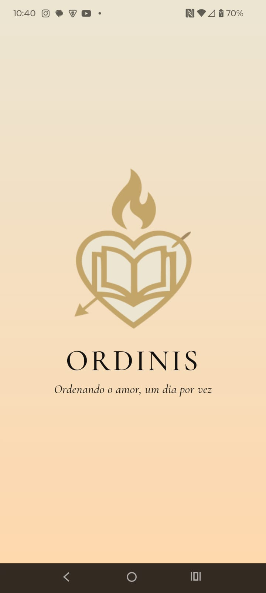
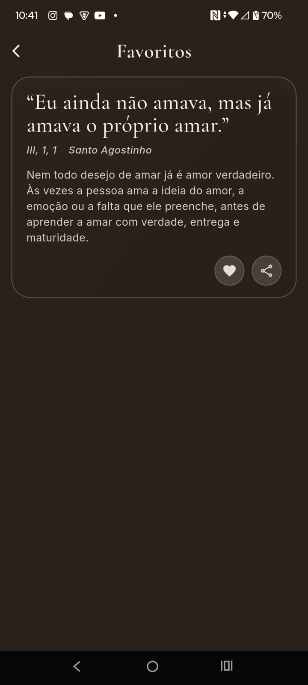

# Ordinis – Reflexões cristãs diárias para ordenar o amor 🤍

  
  
  

  <i>Ordenando o amor, um dia por vez.</i>

---

## EN

> Daily Christian reflections inspired by Saint Augustine, designed to help the soul return to what truly matters.

### ✨ About the App

**Ordinis** is a mobile application centered on daily Christian reflections, inspired by **Saint Augustine** and the pursuit of a life in communion with **Jesus Christ**.

The app was designed to offer a daily pause for contemplation, helping the user cultivate:
- interior silence
- truth
- ordered love
- spiritual recollection
- communion with God

More than simply displaying quotes, Ordinis seeks to transform timeless spiritual wisdom into an accessible daily experience through a careful, elegant, and contemplative interface.

---

### 🎯 Purpose

The main purpose of Ordinis is to make Christian reflection something:
- beautiful
- simple
- accessible
- daily
- meaningful

In a distracted and accelerated world, the app invites the user to slow down and return to the essential.

---

### 📱 Main Features

- Daily reflection system
- Modern explanatory interpretation for each excerpt
- Favorites system
- Reflection sharing
- Offline-first experience
- Elegant and contemplative UI
- Support for local content loading
- Expandable architecture for future features

---

### 🧱 Tech Stack

- **Framework:** Flutter
- **Language:** Dart
- **State Management:** Provider
- **Local Data:** JSON asset
- **Storage:** SharedPreferences / local persistence
- **Typography:** Google Fonts
- **Architecture:** Modular and scalable, feature-oriented

---

### 📦 Libraries and Tools

- `provider`
- `google_fonts`
- `shared_preferences`
- Native Flutter navigation
- Local JSON loading
- Custom UI components

---

### 🎨 Design Principles

Ordinis was designed with a visual identity that reflects:
- serenity
- contemplation
- sobriety
- beauty
- spiritual warmth

The interface prioritizes soft tones, classical typography, generous spacing, and a reading-focused presentation.

---

### 📸 Screenshots

  
  
  

---

## PT-BR

> Reflexões cristãs diárias inspiradas em Santo Agostinho, pensadas para ajudar a alma a voltar ao essencial.

### ✨ Sobre o App

**Ordinis** é um aplicativo mobile de reflexões cristãs diárias, inspirado em **Santo Agostinho** e na busca de uma vida em comunhão com **Jesus Cristo**.

O app foi idealizado para oferecer um momento diário de pausa e contemplação, ajudando o usuário a cultivar:
- silêncio interior
- verdade
- amor ordenado
- recolhimento espiritual
- comunhão com Deus

Mais do que exibir frases, o Ordinis busca transformar sabedoria espiritual atemporal em uma experiência cotidiana acessível, bela e contemplativa.

---

### 🎯 Propósito

O principal propósito do Ordinis é tornar a reflexão cristã algo:
- belo
- simples
- acessível
- diário
- significativo

Em um mundo acelerado e disperso, o aplicativo convida o usuário a desacelerar e retornar ao essencial.

---

### 📱 Funcionalidades Principais

- Sistema de reflexão diária
- Interpretação moderna de cada trecho
- Sistema de favoritos
- Compartilhamento de reflexões
- Experiência offline-first
- Interface elegante e contemplativa
- Suporte a carregamento local de conteúdo
- Arquitetura preparada para expansão futura

---

### 🧱 Stack Técnica

- **Framework:** Flutter
- **Linguagem:** Dart
- **Gerenciamento de Estado:** Provider
- **Dados locais:** JSON em asset
- **Persistência:** SharedPreferences / armazenamento local
- **Tipografia:** Google Fonts
- **Arquitetura:** Modular e escalável, orientada a features

---

### 📦 Bibliotecas e Ferramentas

- `provider`
- `google_fonts`
- `shared_preferences`
- Navegação nativa do Flutter
- Leitura de JSON local
- Componentização de UI customizada

---

### 🎨 Princípios de Design

O Ordinis foi pensado com uma identidade visual que transmite:
- serenidade
- contemplação
- sobriedade
- beleza
- calor espiritual

A interface prioriza tons suaves, tipografia clássica, respiro visual e foco na leitura.

---

### 📸 Imagens do App

  
  
  

---

### 🚀 Possibilidades Futuras

- Notificações diárias
- Categorias de reflexões
- Busca por temas
- Marcação por tags
- Histórico de leituras
- Sincronização em nuvem
- Modo escuro
- Compartilhamento visual com imagem gerada

---

### 👤 Autor

Desenvolvido por **mk**.

Se este projeto te interessou, fique à vontade para acompanhar sua evolução.

